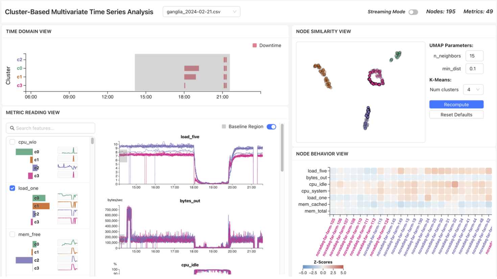

# Cluster-Based Visual Analytics System for HPC Performance Data

## About
- Implementation of two-step DR (PCA+UMAP) with contrastive clusters for feature contributions. 
- Interactive mrDMD to adjust metric baselines and compute per-node devation from baseline(s).



## Requirements
- Python3
- Note: Tested on macOS Tahoe and Ubuntu 24.04 LTS.

### Frontend (React)

### Setup

1. `cd ui`
2. `npm install`

### Usage

1. `cd ui`
2. `npm run start`

## Backend (Flask)

### Setup

1. `cd server`
2. Ensure you're using Python 3.13. If you have `pyenv` installed, it should automatically switch Python versions when you `cd` into `server/`.
3. `python -m venv .venv`
4. `source .venv/bin/activate` (Repeat this whenever you start a new terminal)
5. `pip install -r requirements.txt`
6. Install CCPCA package
   1. Download ccpca repo as zip from [https://github.com/takanori-fujiwara/ccpca](https://github.com/takanori-fujiwara/ccpca):
   2. Download ccpca repo as zip
   3. Unzip in `/server`
   4. `cd ccpca-master`
   5. If you're on MacOS and use Homebrew, update the path to Eigen on lines 46 and 50 `/ccpca-master/ccpca/presetup.py` as follows:

      ```py
      ...
      print("building cPCA")
      os.system(
          f"c++ -O3 -Wall -mtune=native -march=native -shared -std=c++11 -undefined dynamic_lookup -I/opt/homebrew/include/eigen3/ $(python3 -m pybind11 --includes) cpca.cpp cpca_wrap.cpp -o cpca_cpp{extension_suffix}"
      )
      print("building ccPCA")
      os.system(
          f"c++ -O3 -Wall -mtune=native -march=native -shared -std=c++11 -undefined dynamic_lookup -I/opt/homebrew/include/eigen3/ $(python3 -m pybind11 --includes) cpca.cpp cpca_wrap.cpp ccpca.cpp ccpca_wrap.cpp -o ccpca_cpp{extension_suffix}"
      )
      ...
      ```
   6. Install both `ccpca/ccpca/` and `ccpca/fc_view/` as instructed in [https://github.com/takanori-fujiwara/ccpca/blob/master/README.md](https://github.com/takanori-fujiwara/ccpca/blob/master/README.md)

### Usage

1. `cd server`
2. `source .venv/bin/activate`
3. `python server.py`

## References
1. Takanori Fujiwara, Shilpika, Naohisa Sakamoto, Jorji Nonaka, Keiji Yamamoto, and Kwan-Liu Ma, "A Visual Analytics Framework for Reviewing Multivariate Time-Series Data with Dimensionality Reduction". IEEE Transactions on Visualization and Computer Graphics, vol. 27, no. 2, pp. 1601-1611, 2021. [code](https://github.com/takanori-fujiwara/multidr)
1. Takanori Fujiwara, Oh-Hyun Kwon, and Kwan-Liu Ma, "Supporting Analysis of Dimensionality Reduction Results with Contrastive Learning". IEEE Transactions on Visualization and Computer Graphics, 2020. DOI: 10.1109/TVCG.2019.2934251 [code](https://github.com/takanori-fujiwara/ccpca)
1. Kutz, J. N., Fu, X., and Brunton, S. L., 2016, “Multiresolution Dynamic Mode Decomposition”, SIAM J. Appl. Dyn. Syst., 15 (2), pp. 713-735.
2. B. W. Brunton, L. A. Johnson, J. G. Ojemann, and J. N. Kutz, “Extracting spatial–temporal coherent patterns in large-scale neural recordings using dynamic mode decomposition,” Journal of Neuroscience Methods, vol. 258, 2016.
3. mrDMD code modified from https://humaticlabs.com/blog/mrdmd-python/